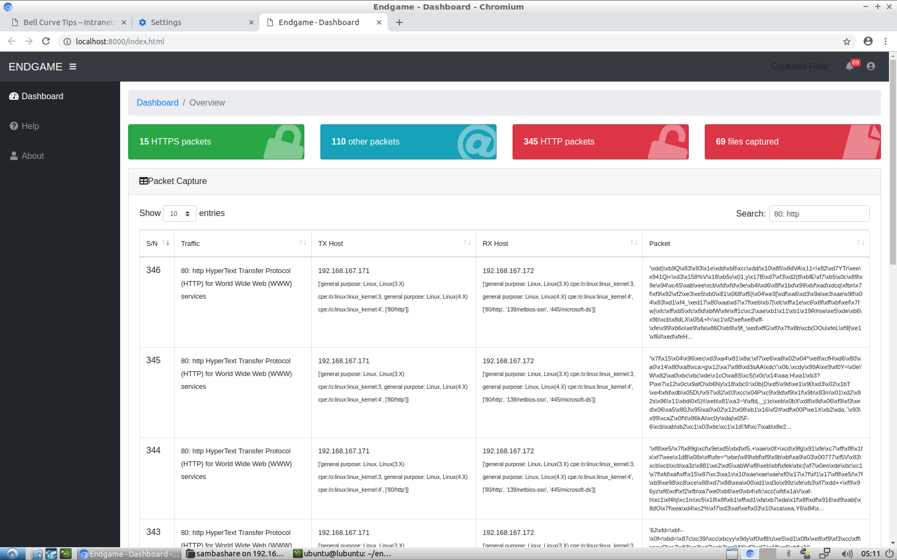
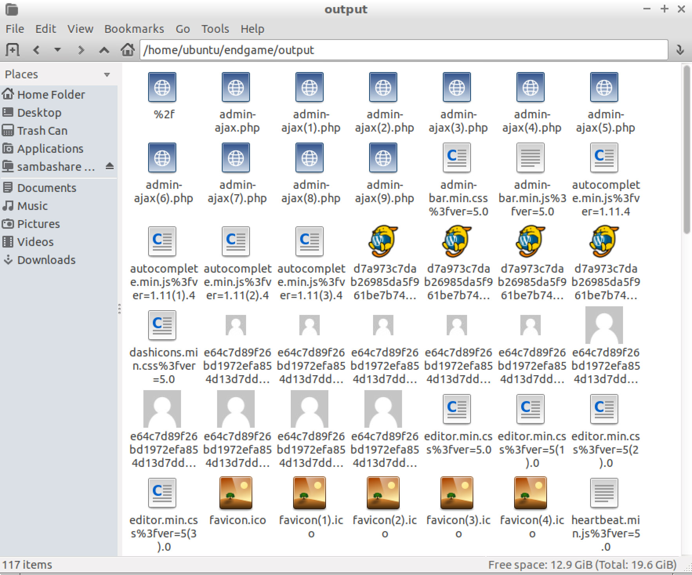

# endgame [](https://opensource.org/licenses/MIT)



### Packet Capture + Interpretation

`endgame` is a Python application that captures packets into a `pcap` file and also interpretes the packets. Currently, `endgame` is able to

* Identify the type of packet (based on source/destination ports)
* Decode into plain test uncompressed unencrypted packet (e.g. HTML or JS files)
* Dump files that are transferred over unencrypted connections (e.g. HTTP, SMB or FTP)



### Motivation

```
TODO
```

### Dependencies

**Python**

* `pip3 install -r requirements.txt`

**Linux**

* tshark

